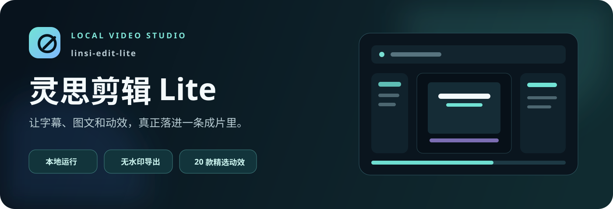
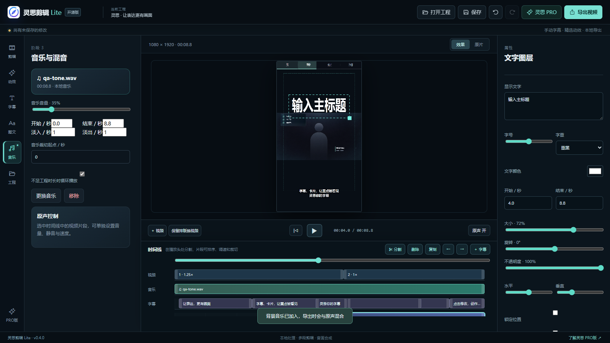
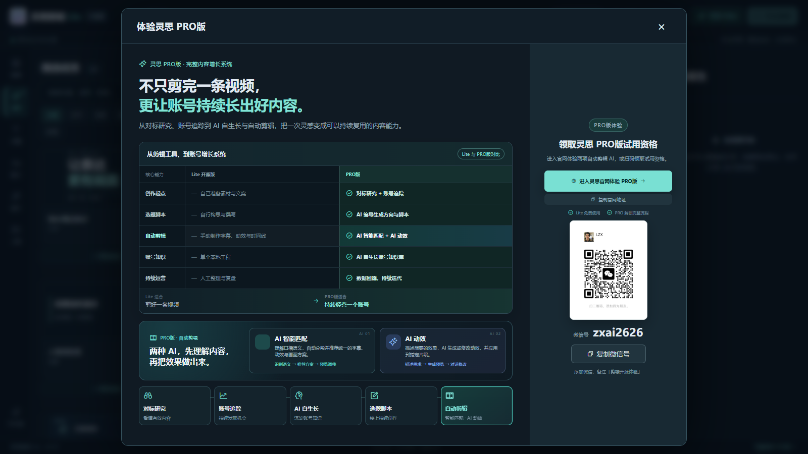
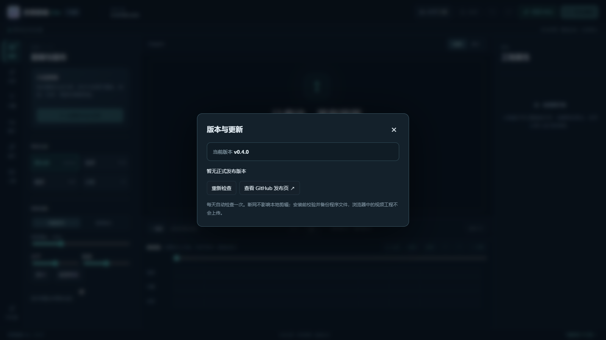

<p align="center">
  
</p>

<p align="center">
  <a href="https://github.com/feiwu6733-arch/linsi-edit-lite/releases/latest"><b>下载最新版</b></a>
  &nbsp;·&nbsp;
  <a href="#3-分钟本地部署"><b>本地部署</b></a>
  &nbsp;·&nbsp;
  <a href="https://os.yanbeiai.com/?utm_source=linsi-edit-lite&utm_medium=readme"><b>体验灵思 PRO版</b></a>
</p>

<p align="center">
  
  
  
  
</p>

灵思剪辑 Lite 是一个可在电脑本地部署的轻量视频编辑器。导入一条视频，即可完成片段剪辑、画布裁切、音乐混音、手动字幕、图文图层、20 款精选动效和无水印 MP4 导出。视频与工程保存在本机，无需配置远程 AI 接口。

## 编辑台一览

<p align="center">
  
</p>

剪辑、动效、字幕、图文、音乐和工程管理集中在同一编辑台。预览与导出使用同一套绘制逻辑，减少“预览效果和成片不一致”的问题。

## 从原片到有表达的成片

<p align="center">
  <a href="docs/assets/before-after-demo.mp4">
    
  </a>
  <br><b>▶ 点击对比图播放 9 秒动效成片演示</b>
  <br><sub>Lite 手动完成字幕、卡片和动效；PRO版使用 AI 智能匹配与 AI 动效减少重复操作</sub>
</p>

<table>
  <tr>
    <td width="50%">
      <h3>Lite：自己掌控每一个画面</h3>
      <p>手动剪辑片段，添加字幕、标题、章节导航、图文卡片和动效，再在本机导出成片。</p>
      <p><b>适合：</b>先体验灵思的视觉语言，完成一条短视频，保存一套可复用工程。</p>
    </td>
    <td width="50%">
      <h3>PRO版：把重复步骤交给 AI</h3>
      <p><b>AI 智能匹配</b>理解口播内容并推荐画面结构；<b>AI 动效</b>按语义生成或修改动效，再接入对标研究、账号追踪和 AI 自生长体系。</p>
      <p><a href="https://os.yanbeiai.com/?utm_source=linsi-edit-lite&utm_medium=readme-auto-edit"><b>前往灵思官网体验 PRO版 →</b></a></p>
    </td>
  </tr>
</table>

> Lite 提供手动/SRT 字幕、20 款精选动效、图文图层、音乐混音、工程保存和本地导出。AI 自动剪辑、自动字幕、删停顿、对标研究、账号追踪与 AI 自生长体系由灵思 PRO版提供。

## 能做什么

| 能力 | Lite 个人版体验 |
| --- | --- |
| ✂️ 多段剪辑 | 分割、删除、复制、排序、裁切、0.25×～4× 变速、独立音量与静音 |
| 🖼️ 画布控制 | 原比例、9:16、16:9、1:1，完整显示/铺满裁切，缩放、移动和安全区 |
| 💬 字幕 | 手动输入或导入 SRT，样式、描边、底色、偏移、拆分、合并与查找替换 |
| ✨ 动效 | 20 款精选组件，动态预览，4 档节奏、4 种入场、4 种退场和过渡控制 |
| 🔤 图文 | 主标题、副标题、引语卡片、本地图片/Logo、层级、锁定、隐藏和复制 |
| 🎵 音乐 | 导入 MP3 / WAV / M4A，调整裁切、音量、循环及淡入淡出 |
| 📦 本地工程 | `.linsi` 工程包携带本地素材，可保存、恢复并在不同浏览器间迁移 |
| 🎬 成片导出 | 本地生成 H.264 + AAC MP4、30fps，无水印，也可单独下载 SRT |

## 3 分钟本地部署

1. 打开 [Releases](https://github.com/feiwu6733-arch/linsi-edit-lite/releases/latest)，下载最新 ZIP。
2. 解压到一个独立文件夹，电脑安装 Python 3.11 或更高版本。
3. 双击 **启动灵思剪辑.cmd**。
4. Chrome / Edge 会打开 `http://127.0.0.1:5031`，建议窗口宽度 1100px 以上。

首次体验可直接点击「打开人物演示」，无需准备素材。建议从 30 秒～3 分钟口播视频开始。

## 使用授权

灵思剪辑 Lite 仅授权个人、非商业的学习与体验。第一次打开会显示使用须知，需要阅读并确认后才能进入编辑台。

- 允许：个人设备安装、本地体验、个人非商业创作和学习源代码。
- 禁止：出售、转售、收费部署、捆绑销售或用本软件提供营利服务。
- 禁止：未经书面授权修改、二次开发、换标、重新打包、再发布或制作软件衍生版本。
- 违规处理：我们会向代码托管、应用发布、内容传播或交易平台投诉并要求下架，同时保留依法追究责任的权利。

完整条款见 [个人非商业使用许可协议](LICENSE)。需要商业使用或二次开发授权，请通过灵思官网联系。

## GitHub 新版本提醒

<p align="center">
  
</p>

本地启动后会自动检查 [GitHub 正式版本](https://github.com/feiwu6733-arch/linsi-edit-lite/releases)。发现新版时，编辑台顶部会显示更新提醒，可查看说明、稍后提醒、忽略本版本，或下载更新并在 Windows 上重启。断网不影响本地剪辑；更新包会校验来源、大小、SHA-256 和包内文件清单。

<details>
<summary><b>完整使用说明</b></summary>

1. 导入 MP4 / MOV / WebM，或点击「打开人物演示」。具体编码需浏览器支持，优先使用 H.264 + AAC 的 MP4。
2. 在播放头处分割，删除、复制和排序片段；拖动片段两端裁切，并单独设置速度、原声音量或静音。
3. 选择画布比例和显示模式，调整缩放、位置及安全区。
4. 导入音乐，调整开始、结束、裁切起点、音量、循环和淡入淡出。
5. 手动输入字幕或导入 SRT，统一样式后按需拆分、合并和偏移。
6. 添加图文与动效，设置显示时间、位置、层级、节奏和入退场。
7. 保存本地工程；完成后导出 MP4 或下载 SRT。

点击素材卡片下方「预览动效」可打开大图，暂停、重播或拖动进度，无需先导入视频。较短片段会自动压缩动画过渡，优先完成内容呈现。经典章节导航支持 2～12 个章节，可单独调整名称、起点及颜色。

「保留排版换视频」会创建新工程并保留文字与动效时间。短视频会截短或移除超出时长的片段；长视频不会自动补充后续字幕，换片后仍需核对文案和时间。

</details>

<details>
<summary><b>本地数据与使用限制</b></summary>

工程保存在当前浏览器、当前网址的 IndexedDB 中。改变端口或浏览器不会自动迁移工程；清理浏览器网站数据会删除工程，操作前请下载工程包或导出成片。刷新前请手动保存，撤销历史只在当前会话保留。

视频上限 1GB，音乐上限 250MB，工程上限 60 分钟、2000 条字幕、200 个动效和 100 个图文图层。带音乐或变速混音的单次导出暂支持 20 分钟以内。证据媒体墙需上传 3 张图片后才能导出，支持 JPG、PNG、WebP，单张最大 10MB。

</details>

## 本地开发

所有依赖独立安装，不引用其他本地项目。

```sh
npm ci
npm test
npm run build
python serve.py --no-browser
```

开发预览使用 `npm run dev`。如 5031 被占用，可运行 `python serve.py --port 5032`，程序不会停止其他服务。发布与更新维护见 [RELEASE.md](RELEASE.md)，第三方许可见 [THIRD_PARTY.md](THIRD_PARTY.md)。

## 灵思 PRO版

PRO版把一次剪辑接入对标研究、账号追踪、AI 自生长、选题脚本、AI 智能匹配和 AI 动效，帮助账号持续产出内容。

**[进入灵思官网体验 PRO版](https://os.yanbeiai.com/?utm_source=linsi-edit-lite&utm_medium=readme-footer)** · 微信 **zxai2626**，备注「剪辑 Lite 体验」。

本工程按公开白名单抽取基础组件并独立实现精简界面，不包含商业版服务端、私人模板、业务数据或模型。
